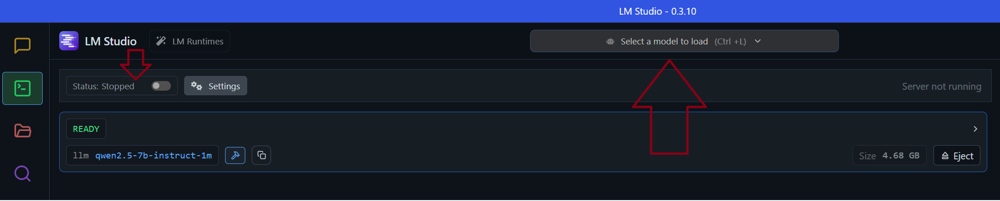

# Terminal Chat Bot

## LM Studio

### 1. Instalacja i uruchomienie LM Studio
#### Pobierz i zainstaluj LM Studio (https://lmstudio.ai/).
#### Uruchom aplikację i pobierz odpowiedni model językowy- qwen2.5 7B Instruct 1M (GGUF).
#### Następnie przechodzimy do zakładki Developer, z górnego menu wybieramy model Qwen'a i włączamy serwer przyciskiem w lewym górnym rogu

#### Po chwili, gdy model zostanie poprawnie załadowany, program jest już gotowy do działania w trybie LM Studio

### 2. Uruchamianie programu
#### Ten projekt został zbudowany przy użyciu Gradle. Repozytorium zawiera wszystkie niezbędne pliki do uruchomienia aplikacji, w tym Gradle Wrapper oraz gotowy build.
#### Aby uruchomić program, wykonaj jedną z poniższych komend w terminalu:

### Na systemie Linux/macOS:
    ./gradlew run
### Na systemie Windows
    .\gradlew.bat run
#### A zbudowanie projektu
    ./gradlew build

### 3. Polecenia użytkownika
#### Po poprawnym odpaleniu programu ChatBot wita użytkownika, w tym momencie możemy już wpisywać swoje wypowiedzi
#### W celu opuszczenia programu wystarczy wprowadzić "exit" (case insensitive)

### 4. Błędy
#### Najczęstszym problemem może być brak połączenia z lokalnym modelem, aby sprawdzić stan połączenia możemy skorzystać z CURL'a
    curl -X POST http://localhost:1234/v1/completions \
    -H "Content-Type: application/json" \
    -d '{
    "model": "qwen2.5-7b-instruct-1m",
    "prompt": "Hello, world!",
    "max_tokens": 50
    }'
#### Jeśli połączenie zostało poprawnie nawiązane, model powinien zwrócić plik JSON z odpowiedzią
